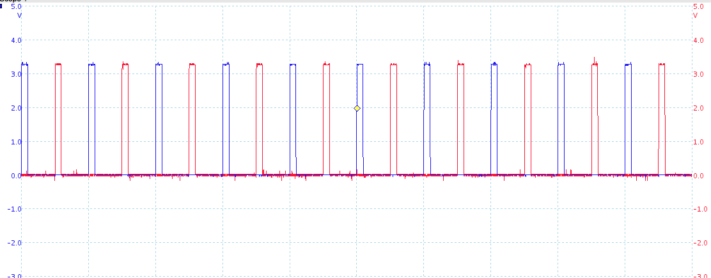

# Half Bridge and High Side PWM driver

Intended for controlling the output from a pair of 4.2Kw BLDC Motors driven as a generator (high side), and as an ultrasound generator for Antifouling (Half Bridge).

This code targets a SAM3XA as found on Arduino Due boards. 

It uses the in build PWM controler to produce a High and Low signal with dead time and PWM. This is achieved by configuring the PWM to run at 50% duty, and adjusting the deadtime. The minimum dead time is 1us with a 42MHz condifured clock. The resolution of the PWM can be varied at the expense of upper frequency. With a 600 step resolution, the upper frequency is 35kHz, with 100 step it would be 42MHz/200 or 201KHz. 

To actually drive MOSFETS still requires a driver chip like the IR2110.

Trying to generate ultrasound using older Arduino boards (eg Mega), is limited to about 31Khz with low PWM resolution. A better approach is to use a SG3525A and Digital pots, although that requires more components and is not as accurate, has a hard to control dead period and results in more heat in the mosfets.

Typical output is below. 

