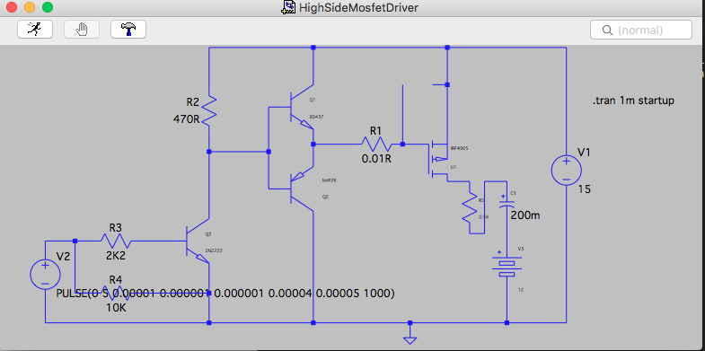
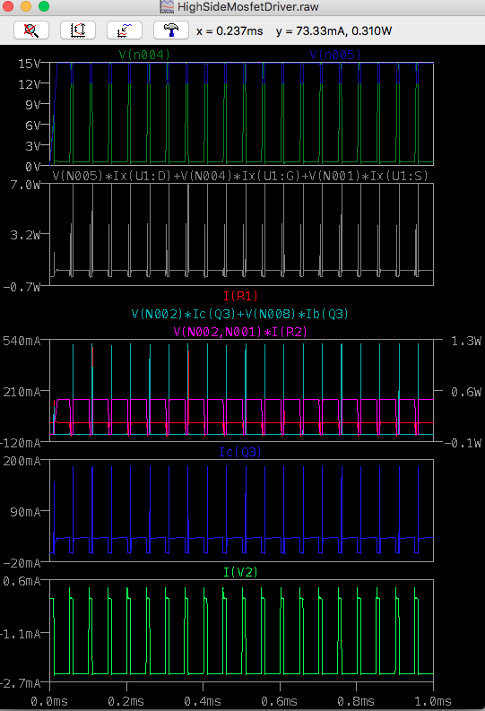

# Collection of LTSpice Simulations

# HighSideMosfetDriver

A High Side P-Channel (IRF4905) Mosfet driver intended to control the output of BLDC motors driven as generators using PWM input. The voltage source V1 is the PWM pulse, V2 is the generator which at open circuit runs at about 30V, and at full power charges at 14.4V 50A. The simulation is done at 200KHz to ensure the switching is fast enough to avoid excessive mosfet heating.

